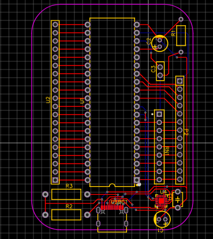

# Arc Micro
Arc Micro features a STC15F2K60S2 with 60KB of flash memory, and built-in EEPROM. There are 34 standard use GPIO pins with a USB-C port to easily flash new firmware to your device.

## General Usage
To start writing firmware for your microcontroller you can use [SDCC](https://sdcc.sourceforge.net/) and write code in C or Assembly. 

_Note: C++ & Python are only **partially** supported by SDCC. Please use with caution._

To flash code to your microcontroller, you can use the [STC ISP](https://www.stcmicro.com/rjxz.html). (*You can use the open source version as well. [https://github.com/grigorig/stcgal](https://github.com/grigorig/stcgal)*)

## Bill of Materials
| Component | Part Number | Quantity |
| :--- | :--- | :--- |
| 100nF Capacitor | 0.1UF(104) +-20% 63v | 1 |
| 10µF Capacitor | 10UF50VC110GL | 1 |
| 20-Pin Female Headers | Female header1X20P 2.54mm | 1 |
| 10kΩ Resistor | TA203PA10K0JE | 1 | 
| 5.1kΩ Resistor | MF1/2W-5.1KΩ±1%T52 | 2 |
| RESISTOR PACK SIP-9 | 4609X-101-472LF | 1 |
| STC15F2K60S2-28I-PDIP40 | STC15F2K60S2-28I-PDIP40 | 1 |
| 22.1184MHz Quartz Clock | 7X-22.1184MBD-T | 1 |
| 8-Pin Female Headers | PPTC081LFBN-RC | 1 |
| 22pF Capacitor | 0402ZA220KAT2A | 2 |
| USB-C Port | USB-C_SMD-TYPE-C-31-M-12_1 | 1 |
| 12MHz Crystal Ocsilator | OSC-SMD_4P-L7.0-W5.0-BL | 1 |
| 6-Pin Female Headers | M20-7820646 | 1 |
| CH340G (USB-UART) | CH340G | 1 |
